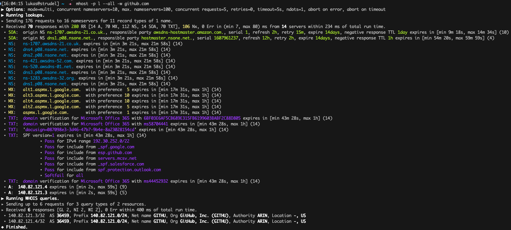
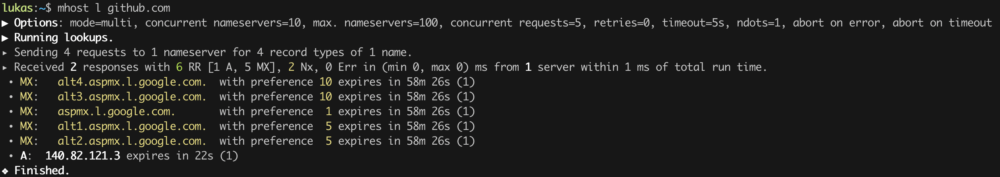
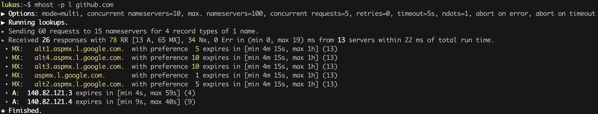
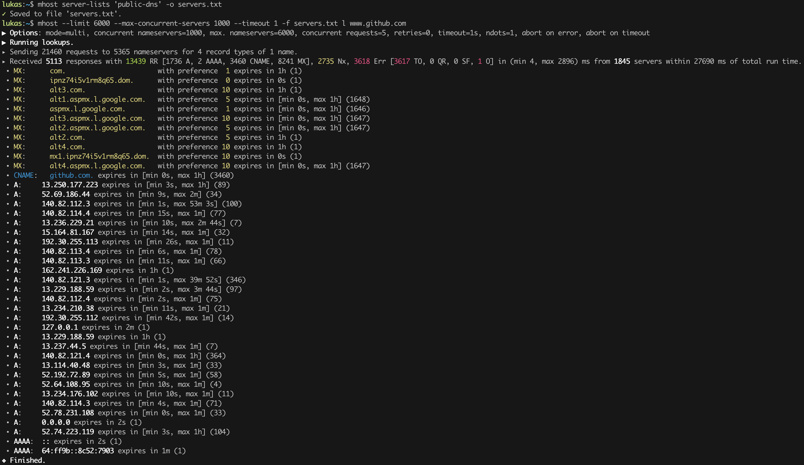
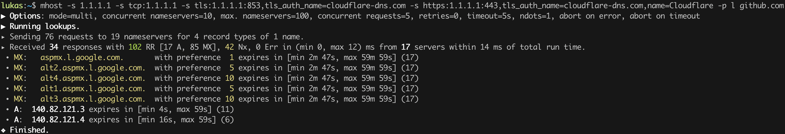
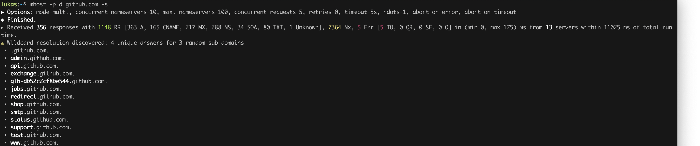
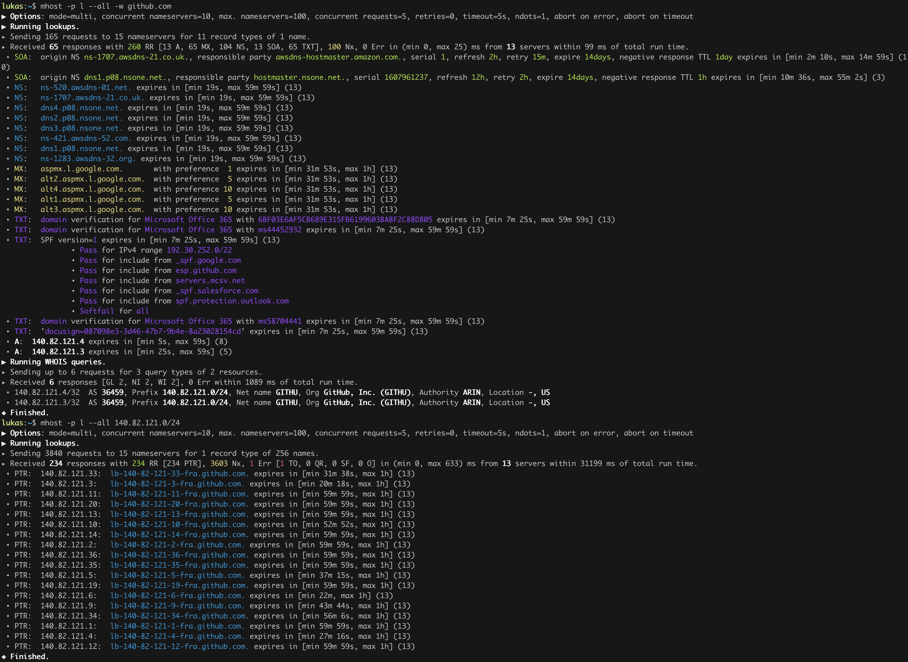
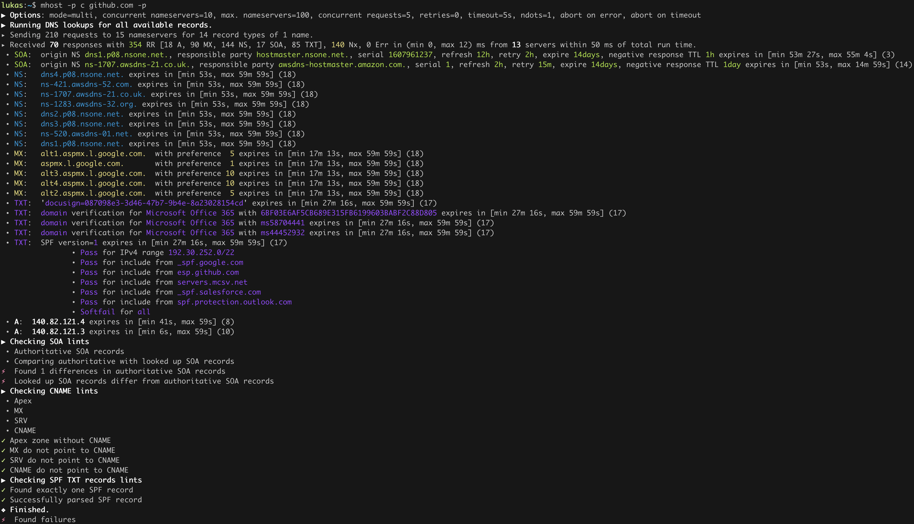

#  mhost

A modern take on the classic `host` DNS lookup utility including an easy to use, and very fast Rust lookup library.

[](https://github.com/lukaspustina/mhost/actions/) [](https://crates.io/crates/mhost) [](https://docs.rs/mhost)  

## Features

-   `mhost` is very fast and uses multiple DNS servers concurrently and aggregates all results for more reliable lookups.

-   `mhost` supports classic DNS over UDP and TCP as well as modern DNS over TLS (DoT) and HTTP (DoH).

-   `mhost` presents results in an easy, human readable format or as JSON for post-processing.

-   `mhost` discovers host names, subdomains of any domain, as well as IP subnets in CIDR notation.

-   `mhost` uses lints to validate the DNS configurations of any domain.

-   `mhost` offers an easy to use Rust library so you can use the same lookup capabilities in your own project.

For details see sections [Use Cases](#Use-Cases) and [Documentation](#_documentation) of this Readme.

## Quick Start

1.  Install `mhost` – see below for [installation instructions](#_installation).

2.  Run `mhost -p l --all -w github.com` and you’ve just asked 16 name servers for all available DNS records of *github.com* in 34 ms. And in addition you get the WHOIS information for GitHub’s subnet. 

3.  Run `mhost -q -p --output json l --all -w github.com  | jq '.lookups[] | .result.Response.records[]? | select(.type == "A") | .data.A'` and get all IPv4 addresses.

4.  Set shell alias `alias host=mhost l` to replace your system’s `host` command.

## Table of Contents

<!-- START doctoc generated TOC please keep comment here to allow auto update -->
<!-- DON'T EDIT THIS SECTION, INSTEAD RE-RUN doctoc TO UPDATE -->

- [Use Cases](#use-cases)
  - [Just lookup an IP address](#just-lookup-an-ip-address)
    - [Just lookup an IP address, using more than just your local name servers](#just-lookup-an-ip-address-using-more-than-just-your-local-name-servers)
  - [Just lookup an IP address, using even more than just your local name servers](#just-lookup-an-ip-address-using-even-more-than-just-your-local-name-servers)
  - [Just lookup an IP address, using UDP, TCP, DoT, and DoH](#just-lookup-an-ip-address-using-udp-tcp-dot-and-doh)
  - [Discover a domain](#discover-a-domain)
  - [Check your name server configuration](#check-your-name-server-configuration)
- [Installation](#installation)
  - [Homebrew](#homebrew)
  - [Debian and Ubuntu](#debian-and-ubuntu)
  - [Redhat and Fedora](#redhat-and-fedora)
  - [For Rust Developers](#for-rust-developers)
  - [From Source](#from-source)
- [Documentation](#documentation)
  - [General Options](#general-options)
  - [Main Commands](#main-commands)
    - [Lookup](#lookup)
    - [Discover](#discover)
    - [Check](#check)
  - [Helper Commands](#helper-commands)
    - [Server Lists](#server-lists)
  - [Architecture Design Records](#architecture-design-records)
- [Changelog](#changelog)
- [Limitations](#limitations)
- [Thanks](#thanks)
- [Postcardware](#postcardware)

<!-- END doctoc generated TOC please keep comment here to allow auto update -->


## Use Cases

### Just lookup an IP address

```sh
$ mhost l github.com
```



In this run, all default settings are applied. Especially, `most` uses only the local system’s name servers and queries only the default record types.

#### Just lookup an IP address, using more than just your local name servers

```sh
$ mhost -p l github.com
```



See, there’re more answers than before!

`-p` add public name servers that `mhost` predefines for your convenience. By default, only the UDP is used to contact the predefined name servers. You can control this behaviour using `--predefined-filter` and filter for UDP, TCP, DoT, DoH. `--list-predefined` show all available predefined name servers.

### Just lookup an IP address, using even more than just your local name servers

```sh
$ mhost server-lists public-dns -o servers.txt
$ mhost --limit 6000 --max-concurrent-servers 1000 --timeout 1 -f servers.txt l www.github.com
```



See, there’re even more answers than before!

The first command downloads a list of public available name servers that are maintained by the [Public DNS](https://public-dns.info) community. Usually only a subset of these are reachable, but it still a large set of active name servers.

The second command uses the name servers list from before and queries all of them concurrently. These settings are very aggressive and highly stresses your internet connection. `mhost` default settings are set much more cautiously.

### Just lookup an IP address, using UDP, TCP, DoT, and DoH

```sh
$ mhost -s 1.1.1.1 -s tcp:1.1.1.1 -s tls:1.1.1.1:853,tls_auth_name=cloudflare-dns.com -s https:1.1.1.1:443,tls_auth_name=cloudflare-dns.com,name=Cloudflare -p l github.com
```

As already mentioned before, `mhost` supports DNS queries over UDP, TCP, DNS over TLS (DoT), as well as DNS over HTTPS (DoH). In the above example, `mhost` uses all four protocols to query Cloudflare’s name servers.

This command also shows the syntax for name server specification, which in general is `protocol:<host name | ip address>:port,tls_auth_name=hostname,name=human-readable-name`.



### Discover a domain

Sometimes you want to know which host names and subdomains a domain has. `mhost` offers a simple command to help you find these. Please mind, that `mhost` only uses DNS specific discovery methods. If you want even deeper discoveries using Google, Shodan etc. there are other tools available.

```sh
$ mhost -p d github.com -p
```

This command uses the predefined name servers to discover the GitHub domain. The `-s` reduces all discovered names to real subdomains of `github.com.`.



You can go one more step and explore the autonomous systems GitHub uses. In order to discover those, you can use the following commands:

```sh
$ mhost -p l --all -w github.com
$ mhost -p l --all 140.82.121.0/24
```



### Check your name server configuration

```sh
$ mhost -p c github.com -p
```



## Installation

### Homebrew

You can add this repository as a custom tap and then install `mhost` like this:

```sh
$ brew tap lukaspustina/mhost https://github.com/lukaspustina/mhost.git
$ brew install lukaspustina/mhost/mhost
```

### Debian and Ubuntu

You can find Debian packages on the [GitHub Release](https://github.com/lukaspustina/mhost/releases) page. Download the package as `mhost.deb` and the run

```sh
$ dpkg -i mhost.deb
```

### Redhat and Fedora

You can find RPM packages on the [GitHub Release](https://github.com/lukaspustina/mhost/releases) page. Download the package as `mhost.rpm` and the run

```sh
$ rpm -i mhost.rpm
```

### For Rust Developers

```sh
$ cargo install --all-features mhost
```

### From Source

Please install Rust via [rustup](https://www.rustup.rs) and then run

```sh
$ git clone https://github.com/lukaspustina/mhost
$ cd mhost
$ make install
```

## Documentation

`mhost` has three main commands: *lookup*, *discover*, and *check*. *lookup* lookups up arbitrary DNS records of a domain name. *discover* tries various methods to discover host names and subdomains of a domain. *check* uses lints to check if all records of a domain name adhere to the DNS RFC.

### General Options

```plain
    --use-system-resolv-opt                 Uses options set in /etc/resolv.conf
    --no-system-nameservers                 Ignores nameservers from /etc/resolv.conf
-S, --no-system-lookups                     Ignores system nameservers for lookups
    --resolv-conf <FILE>                    Uses alternative resolv.conf file
    --ndots <NUMBER>                        Sets number of dots to qualify domain name as FQDN [default: 1]
    --search-domain <DOMAIN>                Sets the search domain to append if HOSTNAME has less than ndots dots
    --system-nameserver <IP ADDR>...        Adds system nameserver for system lookups; only IP addresses allowed
-s, --nameserver <HOSTNAME | IP ADDR>...    Adds nameserver for lookups
-p, --predefined                            Adds predefined nameservers for lookups
    --predefined-filter <PROTOCOL>...       Filters predefined nameservers by protocol [default: udp]  [possible
                                            values: udp, tcp, https, tls]
    --list-predefined                       Lists all predefined nameservers
-f, --nameservers-from-file <FILE>          Adds nameservers from file
    --limit <NUMBER>                        Sets max. number of nameservers to query [default: 100]
    --max-concurrent-servers <NUMBER>       Sets max. concurrent nameservers [default: 10]
    --max-concurrent-requests <NUMBER>      Sets max. concurrent requests per nameserver [default: 5]
    --retries <NUMBER>                      Sets number of retries if first lookup to nameserver fails [default: 0]
    --timeout <TIMEOUT>                     Sets timeout in seconds for responses [default: 5]
-m, --resolvers-mode <MODE>                 Sets resolvers lookup mode [default: multi]  [possible values: multi,
                                            uni]
    --wait-multiple-responses               Waits until timeout for additional responses from nameservers
    --no-abort-on-error                     Sets do-not-ignore errors from nameservers
    --no-abort-on-timeout                   Sets do-not-ignore timeouts from nameservers
    --no-aborts                             Sets do-not-ignore errors and timeouts from nameservers
-o, --output <FORMAT>                       Sets the output format for result presentation [default: summary]
                                            [possible values: json, summary]
    --output-options <OPTIONS>...           Sets output options
    --show-errors                           Shows error counts
-q, --quiet                                 Does not print anything but results
    --no-color                              Disables colorful output
    --ascii                                 Uses only ASCII compatible characters for output
-v                                          Sets the level of verbosity
    --debug                                 Uses debug formatting for logging -- much more verbose
```

### Main Commands

#### Lookup

```plain
-t, --record-type <RECORD TYPE>...    Sets record type to lookup, will be ignored in case of IP address lookup
                                        [default: A,AAAA,CNAME,MX]  [possible values: A, AAAA, ANAME, ANY, CNAME, MX,
                                        NULL, NS, PTR, SOA, SRV, TXT]
    --all                             Enables lookups for all record types
-s, --service                         Parses ARG as service spec and set record type to SRV
-w, --whois                           Retrieves Whois information about A, AAAA, and PTR records
-h, --help                            Prints help information
-V, --version                         Prints version information

<DOMAIN NAME | IP ADDR | CIDR BLOCK [| SERVICE SPEC]>    domain name, IP address, or CIDR block to lookup
        domain name, IP address, CIDR block, or, if -s, SERVICE SPEC, to lookup"
        * DOMAIN NAME may be any valid DNS name, e.g., lukas.pustina.de
        * IP ADDR may be any valid IPv4 or IPv4 address, e.g., 192.168.0.1
        * CIDR BLOCK may be any valid IPv4 or IPv6 subnet in CIDR notation, e.g., 192.168.0.1/24
            all valid IP addresses of a CIDR block will be queried for a reverse lookup
        * SERVICE SPEC may be specified by name, protocol, and domain name, delimited by colons. If protocol is
        omitted, tcp is assumed, e.g.,
            * dns:udp:example.com is _dns._udp.example.com
            * smtp:tcp:example.com is _smtp._tcp.example.com
            * smtp::example.com is _smtp._tcp.example.com
```

#### Discover

```plain
-p, --show-partial-results         Shows results after each lookup step
-w, --wordlist-from-file <FILE>    Uses wordlist from file
    --rnd-names-number <NUMBER>    Sets number of random domain names to generate for wildcard resolution check
                                    [default: 3]
    --rnd-names-len <LEN>          Sets length of random domain names to generate for wildcard resolution check
                                    [default: 32]
-s, --subdomains-only              Shows subdomains only omitting all other discovered names
```

#### Check

```plain
-p, --show-partial-results         Shows results after each check step
-i, --show-intermediate-lookups    Shows all lookups made during by all checks
    --no-cnames                    Does not run cname lints
    --no-soa                       Does not run SOA check
    --no-spf                       Does not run SPF check
```

### Helper Commands

#### Server Lists

```plain
-o, --output-file <FILE>    Sets path to output file
<SERVER LIST SPEC>...
    SERVER LIST SPEC as <SOURCE>[:OPTIONS,...]
    * 'public-dns' with options - cf. https://public-dns.info
        '<top level country domain>': options select servers from that country
        Example: public-dns:de
    * 'opennic' with options; uses GeoIP to select servers - cf. https://www.opennic.org
        'anon' - only return servers with anonymized logs only; default is false
        'number=<1..>' - return up to 'number' servers; default is 10
        'reliability=<1..100> - only return server with reliability of 'reliability'% or more; default 95
        'ipv=<4|6|all> - return IPv4, IPv6, or both servers; default all
        Example: opennic:anon,number=10,ipv=4
```

### Architecture Design Records

The subdirectory [doc/adr](doc/adr/) contains Architecture Design Records (ADRs) for this project. Record keeping has started during the project so not all decisions have been recorded. I still hope they will help everybody interested including me to understand the rational of design decisions.

## Changelog

Please see the [CHANGELOG](CHANGELOG.md) for a release history.

## Limitations

-   Currently `mhost` only supports class `IN`.

-   Only a limited set of DNS record types is supported.

-   The Docker test environment only works completely on Linux due to [limitations](https://docs.docker.com/docker-for-mac/networking/#known-limitations-use-cases-and-workarounds) in Docker for macOS.

## Thanks

Thanks to [Benjamin Fry](https://github.com/bluejekyll) for his literally wonderful [Trust-DNS](http://trust-dns.org) server and the corresponding client library which does all the heavy DNS lifting of `mhost`.

## Postcardware

You’re free to use `mhost`. If you find it useful, I would highly appreciate you sending me a postcard from your hometown mentioning how you use `mhost`. My work address is

```plain
     Lukas Pustina
     CenterDevice GmbH
     Rheinwerkallee 3
     53227 Bonn
     Germany
```

