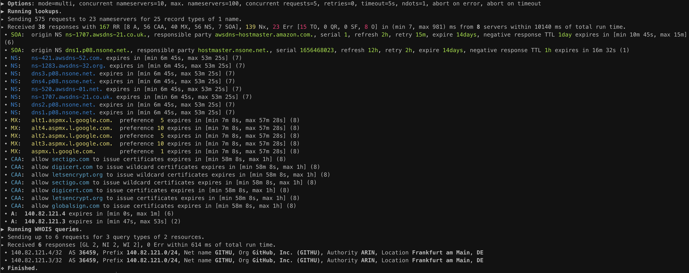
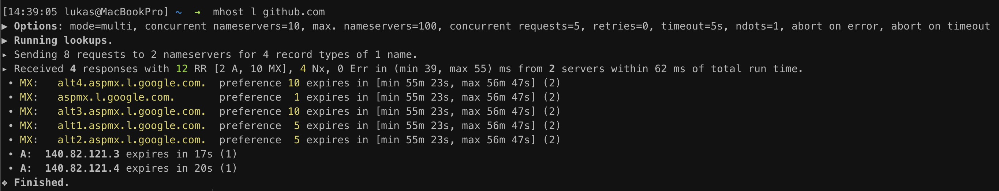
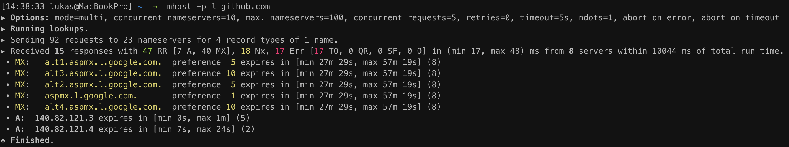
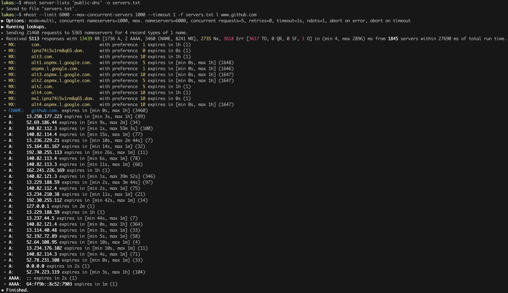
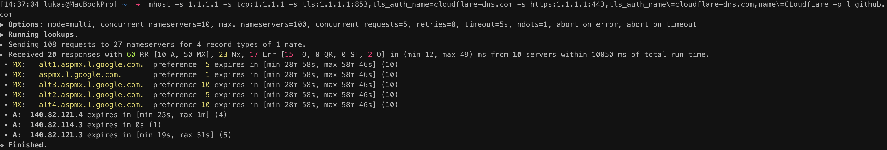
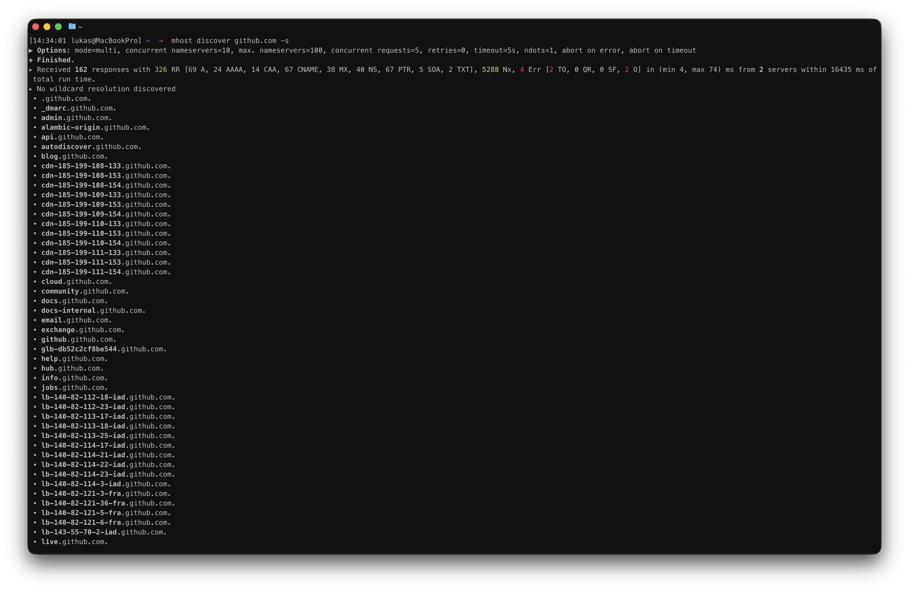
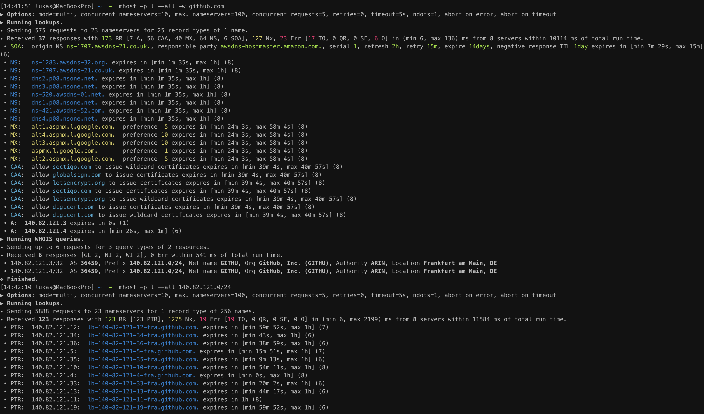
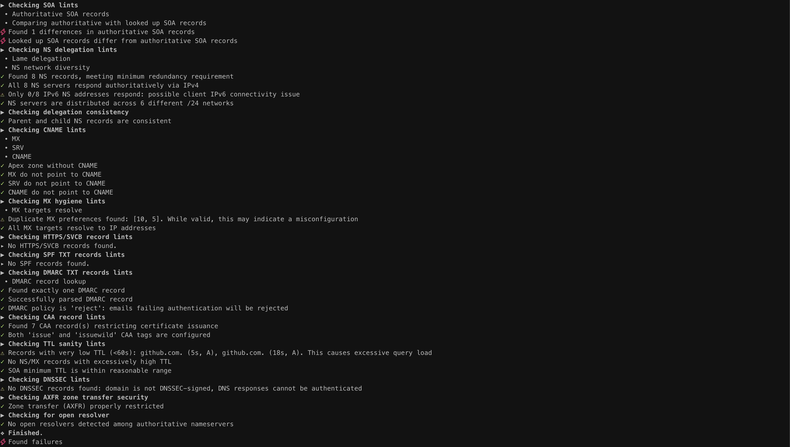

#  mhost

**More than host** -- a modern, high-performance DNS Swiss Army knife and Rust library.

[](https://github.com/lukaspustina/mhost/actions/workflows/ci.yml) [](https://crates.io/crates/mhost) [](https://docs.rs/mhost) [](https://github.com/lukaspustina/mhost/releases)  

mhost queries many DNS servers in parallel and aggregates their answers. It supports UDP, TCP, DNS-over-TLS, and DNS-over-HTTPS, understands 20 record types, and ships with 84 pre-configured public resolvers. Beyond simple lookups it can profile an entire domain, discover subdomains, trace the delegation chain, validate your DNS configuration, check propagation, diff records across nameservers, and verify live DNS against a zone file -- all from a single binary.

**Two ways to use it:** `mhost` is a powerful CLI for scripts, pipelines, and quick one-liners. `mdive` is an interactive TUI that lets you explore DNS like a file manager -- drill into subdomains, discover hidden records, and chase references across domains, all without leaving your terminal.

## Quick Start

```sh
# Install (pick one)
brew install lukaspustina/mhost/mhost          # macOS
cargo install --features app mhost             # Rust toolchain (CLI only)
cargo install --features tui mhost             # Rust toolchain (CLI + TUI)
docker run lukaspustina/mhost:latest mhost l github.com   # Try without installing

# Look up github.com using your system nameservers
mhost l github.com

# Add 84 public resolvers from 6 providers for broader results
mhost -p l github.com

# Get ALL record types + WHOIS info in one shot
mhost -p l --all -w github.com

# Pipe to jq for scripting
mhost -q -p --output json l --all github.com \
  | jq '.lookups[] | .result.Response.records[]? | select(.type == "A") | .data.A'

# Or just dive in interactively
mdive github.com
```



**Pro tip:** `alias host="mhost l"` and never look back.

## What Can mhost Do?

| Command | Alias | What it does |
|---------|-------|--------------|
| [`lookup`](#lookup) | `l` | Look up DNS records for a domain, IP address, or CIDR block |
| [`domain-lookup`](#domain-lookup) | `domain` | Profile a domain -- apex + 68 well-known subdomains in one operation |
| [`discover`](#discover) | `d` | Find subdomains using 10+ strategies (wordlists, CT logs, AXFR, NSEC walking, ...) |
| [`check`](#check) | `c` | Validate DNS configuration against 13 lints (SOA, NS, SPF, DMARC, DNSSEC, ...) |
| [`trace`](#trace) | `t` | Trace the delegation path from root servers, querying all servers at each hop |
| [`propagation`](#propagation) | `prop` | Check whether a DNS change has propagated across public resolvers |
| [`verify`](#verify) | `v` | Verify live DNS matches a BIND zone file -- catch drift before it bites |
| [`diff`](#diff) | -- | Compare DNS records between nameservers or JSON snapshots |
| [`info`](#info) | -- | Built-in reference for record types, TXT sub-types, and well-known subdomains |
| `server-lists` | -- | Download public nameserver lists for large-scale queries |
| `completions` | -- | Generate shell completions (bash, zsh, fish) |

**Looking for a UI?** [`mdive`](#mdive--interactive-tui) is an interactive TUI for exploring DNS -- drill down, discover, and investigate, all without leaving your terminal.

---

## Use Cases

### Simple Lookup

```sh
mhost l github.com
```



This uses your system nameservers and queries the default record types (A, AAAA, CNAME, MX).

### More Nameservers, More Answers

```sh
mhost -p l github.com
```



`-p` adds mhost's 84 predefined public nameservers from Cloudflare, Google, Quad9, Mullvad, Wikimedia, and DNS4EU. More servers means more confidence that you're seeing the full picture.

### Go Big -- Thousands of Nameservers

```sh
mhost server-lists public-dns -o servers.txt
mhost --limit 6000 --max-concurrent-servers 1000 --timeout 1 -f servers.txt l www.github.com
```



Download a community-maintained list of public resolvers, then fire queries at all of them. These settings are intentionally aggressive -- mhost defaults are much more cautious.

### All Four Protocols at Once

```sh
mhost \
  -s 1.1.1.1 \
  -s tcp:1.1.1.1 \
  -s tls:1.1.1.1:853,tls_auth_name=cloudflare-dns.com \
  -s https:1.1.1.1:443,tls_auth_name=cloudflare-dns.com,name=Cloudflare \
  l github.com
```



Nameserver spec format: `protocol:host:port,tls_auth_name=hostname,name=label`

### Profile an Entire Domain

```sh
mhost -p domain-lookup example.com         # ~42 well-known entries
mhost -p domain-lookup --all example.com   # ~68 entries (extended set)
```

One command queries the apex plus dozens of well-known subdomains: email auth (DMARC, MTA-STS, BIMI, TLS-RPT), SRV services (IMAP, SMTP, CalDAV, XMPP, Matrix, ...), DANE/TLSA records, and more.

### Discover Subdomains

```sh
mhost -p d github.com
```



mhost chains 10+ discovery strategies automatically:

1. Standard DNS record lookups
2. Certificate Transparency logs (crt.sh)
3. TXT record mining for referenced domains
4. SRV service probing
5. Wildcard detection via random subdomain probes
6. Zone transfer (AXFR) attempts
7. NSEC walking
8. Wordlist brute force (424 built-in entries, or supply your own with `-w`)
9. Subdomain permutation on discovered names
10. Recursive discovery on found subdomains (`--depth 1..3`)
11. Reverse DNS lookups on discovered IPs

You can also explore a domain's autonomous systems:

```sh
mhost -p l --all -w github.com
mhost -p l --all 140.82.121.0/24
```



### Validate DNS Configuration

```sh
mhost -p c github.com
```



The `check` command runs 13 lints against a domain's DNS records:

| Lint | What it checks |
|------|---------------|
| SOA | Start of Authority record validity |
| NS | NS delegation, lame delegation, network diversity |
| CNAME | CNAME usage rules |
| MX | Null MX, duplicate preferences, target resolution |
| SPF | SPF record syntax and policy |
| DMARC | DMARC policy validation |
| CAA | Certificate Authority Authorization tags |
| TTL | TTL consistency across records |
| DNSSEC | DNSSEC presence and configuration |
| HTTPS/SVCB | Service binding record well-formedness |
| AXFR | Zone transfer exposure |
| Open Resolver | Open resolver detection |
| Delegation | Delegation consistency |

Disable any lint individually: `--no-soa`, `--no-spf`, `--no-dnssec`, etc.

### Trace the Delegation Chain

```sh
mhost trace example.com
mhost trace -t AAAA --show-all-servers example.com
```

Unlike `dig +trace` which queries one server per hop, mhost's `trace` command queries **all nameservers at each delegation level in parallel**. It detects referral divergence (where different root/TLD servers disagree), reports per-server latency, and resolves missing glue records automatically.

### Check DNS Propagation

```sh
mhost -p propagation example.com
mhost -p prop --all example.com
```

After making a DNS change, check whether it has reached all the major public resolvers. Uses the predefined nameserver set (Cloudflare, Google, Quad9, Mullvad, Wikimedia, DNS4EU).

### Diff Records Between Nameservers

```sh
mhost diff --left 8.8.8.8 --right 1.1.1.1 example.com
mhost diff --left 8.8.8.8 --right 1.1.1.1 --all example.com
```

Compare what two different nameserver sets return for the same domain. Useful for debugging inconsistencies or verifying migrations.

You can also diff against saved JSON snapshots for migration validation and change tracking:

```sh
# Save a snapshot
mhost lookup -s 8.8.8.8 -q -t A,AAAA,MX example.com --output json > before.json

# Later, diff snapshot against live DNS
mhost diff --left-from-file before.json --right 1.1.1.1 example.com

# Or compare two snapshots offline
mhost diff --left-from-file before.json --right-from-file after.json example.com
```

### Verify DNS Against a Zone File

```sh
mhost verify example.com.zone
```

Pushed a DNS change and wondering if it actually landed? `verify` reads a BIND zone file -- the most widely used format for DNS zone specification -- compares every record against live DNS, and tells you exactly what matches, what's missing, and what showed up unexpectedly. Non-zero exit code on mismatch, so it drops straight into CI pipelines.

```sh
# Verify against your authoritative nameserver
mhost -s ns1.example.com verify example.com.zone

# Check propagation to public resolvers
mhost -p verify example.com.zone

# Strict mode: also flag TTL differences
mhost verify --strict example.com.zone

# Only check mail-related records
mhost verify --only-type MX,TXT example.com.zone

# CI one-liner
mhost verify zones/example.com.zone || notify_team "DNS drift detected"
```

**Don't have a zone file?** BIND zone format is the universal lingua franca of DNS -- almost every DNS provider can export to it, and tools like `dig`, `nsd`, and BIND itself all speak it natively. If your DNS lives in Terraform, Pulumi, CloudFormation, or any other IaC tool, just ask an LLM to convert the state to a BIND zone file. For example, feed `terraform show -json` output to your favorite LLM and ask for a zone file -- it takes seconds and gives you a portable, version-controllable source of truth you can verify against at any time.

### Look Up Record Type Info

```sh
mhost info            # List all supported types
mhost info MX         # Details about MX records
mhost info SPF        # Details about SPF TXT sub-type
mhost info _dmarc     # Details about the _dmarc well-known subdomain
```

Built-in reference with summaries, details, and RFC references for every supported record type, TXT sub-type, and well-known subdomain.

---

## mdive -- Interactive TUI

While `mhost` is built for scripts and one-liners, `mdive` is built for humans. It's an interactive terminal UI that turns DNS exploration into something that actually feels good -- think "file manager for DNS." Type a domain, watch records stream in from multiple servers in real time, then drill into anything interesting.

```sh
mdive example.com                        # Dive right in
mdive -p example.com                     # Use 84 public resolvers for broader coverage
mdive -s 8.8.8.8 -s 1.1.1.1 example.com # Pick your own nameservers
```

### What You Get

**A live, sortable record table.** All DNS records for a domain -- apex plus dozens of well-known subdomains across 10 categories (email auth, TLS/DANE, SRV services, infrastructure, and more). Results stream in progressively as servers respond, with a real-time progress bar in the status line. Toggle between raw DNS wire format and human-readable values with a single keypress.

**Drill-down navigation.** See a CNAME pointing somewhere interesting? Press `l` to follow it. Found a subdomain in the results? Hit Enter to dive in. Every query is pushed onto a history stack, so Backspace takes you right back. It's like `cd` and `cd ..` but for DNS.

**Five discovery strategies, one keypress away.** Press `d` to open the discovery panel, then launch any combination:

| Key | Strategy | What it does |
|-----|----------|--------------|
| `c` | CT Logs | Search Certificate Transparency logs via crt.sh |
| `w` | Wordlist | Brute-force 424 common subdomain names (with automatic wildcard filtering) |
| `s` | SRV Probing | Probe 22 well-known SRV service records |
| `t` | TXT Mining | Extract referenced domains from SPF includes and DMARC URIs |
| `p` | Permutation | Generate variations of already-discovered labels (dev-, staging-, -prod, ...) |
| `a` | All | Run everything at once |

Discovered subdomains appear in the main table as they're found. Wildcard detection runs automatically to filter false positives.

**Built-in DNS health checks.** Press `c` to run best-practice lints against the current domain -- CNAME-at-apex detection, NS redundancy, SPF/DMARC validation, DNSSEC chain verification, HTTPS/SVCB mode checks, CAA coverage, TTL sanity, and more. Each result shows pass/warning/fail with a clear explanation.

**WHOIS and geolocation.** Press `w` and mdive fetches WHOIS data for every IP in your results -- AS numbers, network prefixes, organizations, countries, and geolocations. Handy for understanding where a domain's infrastructure actually lives.

**Server response dashboard.** Press `s` to see every nameserver that responded, sorted by latency -- protocol, response counts, error counts, and min/avg/max timing. The stats panel (`S`) shows a compact summary right in the status bar: record type distribution, query health, DNSSEC status, and response time ranges.

**Regex filtering.** Press `/` and type a pattern. Matches against record names, types, and values in real time. Quickly zero in on that one TXT record in a sea of results.

### Keybindings

mdive uses vi-style navigation with a few extras:

| Key | Action | Key | Action |
|-----|--------|-----|--------|
| `j`/`k` | Move down/up | `i` | Enter domain query |
| `gg`/`G` | First/last row | `/` | Filter (regex) |
| `22gg` | Jump to line 22 | `C` | Clear filter |
| PgUp/PgDn | Scroll by 10 | `r` | Re-run query |
| Enter | Drill into subdomain | `h` | Toggle human view |
| `l`/Right | Follow value target | `S` | Toggle stats |
| Left/BS | Go back in history | Tab | Cycle grouping |
| `1`-`0` | Toggle categories | `a`/`n` | All/none categories |
| `o` | Record detail popup | `?` | Help |

### Category Toggles

Records are organized into 10 categories. Toggle any with number keys, or press `a` for all / `n` for none:

| Key | Category | Key | Category |
|-----|----------|-----|----------|
| `1` | Email Auth (DMARC, SPF, ...) | `6` | Infrastructure (LDAP, Kerberos) |
| `2` | Email Services (IMAP, SMTP) | `7` | Modern Protocols (STUN, TURN) |
| `3` | TLS / DANE | `8` | Verification & Metadata |
| `4` | Communication (SIP, XMPP, Matrix) | `9` | Legacy |
| `5` | Calendar & Contacts (CalDAV) | `0` | Gaming |

Cycle the grouping mode with Tab: **Category** (default) -> **Record Type** -> **Name** -> **Server**.

### CLI Options

```
mdive [OPTIONS] [DOMAIN]

Options:
  -s, --nameserver <SPEC>          Add a nameserver (repeatable)
  -p, --predefined                 Add 84 predefined public nameservers
      --predefined-filter <PROTO>  Filter predefined by protocol [udp, tcp, tls, https]
  -S, --no-system-lookups          Skip system nameservers
  -t, --timeout <SECS>             Query timeout [default: 5] (1-30)
  -4, --ipv4-only                  IPv4 only
  -6, --ipv6-only                  IPv6 only
  -h, --help                       Print help
```

### Building mdive

mdive lives behind the `tui` feature flag to keep the default build lean:

```sh
cargo build --features tui         # Build both mhost and mdive
cargo run --bin mdive --features tui -- example.com
```

---

## Installation

### Homebrew (macOS)

```sh
brew install lukaspustina/mhost/mhost
```

### Docker

```sh
docker run lukaspustina/mhost:latest mhost l example.com
```

### Debian / Ubuntu

Download the `.deb` from the [latest GitHub Release](https://github.com/lukaspustina/mhost/releases):

```sh
dpkg -i mhost.deb
```

### Redhat / Fedora

Download the `.rpm` from the [latest GitHub Release](https://github.com/lukaspustina/mhost/releases):

```sh
rpm -i mhost.rpm
```

### Cargo (Rust developers)

```sh
cargo install --features app mhost       # CLI only
cargo install --features tui mhost       # CLI + interactive TUI (mdive)
```

### From Source

```sh
git clone https://github.com/lukaspustina/mhost
cd mhost
make install                             # CLI only
cargo install --features tui --path .    # CLI + TUI
```

---

## Global Options

mhost has a rich set of options that apply to all commands:

```
Nameserver selection:
  -s, --nameserver <SPEC>           Add a nameserver (IP, or protocol:host:port,...)
  -p, --predefined                  Add 84 predefined public nameservers
      --predefined-filter <PROTO>   Filter predefined by protocol [udp, tcp, tls, https]
      --list-predefined             Show all predefined nameservers
  -f, --nameservers-from-file <F>   Load nameservers from file
      --no-system-nameservers       Skip /etc/resolv.conf nameservers
  -S, --no-system-lookups           Skip system nameservers for lookups

IP version filtering:
  -4, --ipv4-only                   Only use IPv4 nameservers and return IPv4 results
  -6, --ipv6-only                   Only use IPv6 nameservers and return IPv6 results

Concurrency & resilience:
      --limit <N>                   Max nameservers to query [default: 100] (1-10000)
      --max-concurrent-servers <N>  Max concurrent nameservers [default: 10] (1-100)
      --max-concurrent-requests <N> Max concurrent requests per server [default: 5] (1-50)
      --retries <N>                 Retries per server [default: 0] (0-10)
      --timeout <SECS>              Response timeout [default: 5] (1-300)
      --continue-on-error           Continue on server errors
      --continue-on-timeout         Continue on server timeouts
      --wait-multiple-responses     Wait for additional responses until timeout

Output:
  -o, --output <FORMAT>             Output format: summary or json [default: summary]
  -q, --quiet                       Only print results (no status messages)
      --no-color                    Disable colored output
      --ascii                       ASCII-only output (no Unicode symbols)
      --show-errors                 Show error counts
  -v                                Increase verbosity (repeat for more)
```

## Command Reference

### Lookup

```sh
mhost l [OPTIONS] <DOMAIN | IP | CIDR | SERVICE SPEC>
```

```
  -t, --record-type <TYPE>   Record types [default: A,AAAA,CNAME,MX]
      --all                  Query all record types
  -s, --service              Parse argument as SRV service spec
  -w, --whois                Include WHOIS information for A/AAAA/PTR results
```

Accepts domain names, IPv4/IPv6 addresses, CIDR blocks (reverse lookup of all IPs in range), and SRV service specs (`smtp:tcp:example.com` or `dns:udp:example.com`).

### Domain Lookup

```sh
mhost domain-lookup [OPTIONS] <DOMAIN>
```

```
      --all                     Include extended well-known subdomains (~68 total)
  -p, --show-partial-results    Show results incrementally
```

Queries the apex plus well-known subdomains covering:
- **Apex**: A, AAAA, MX, NS, SOA, CAA, HTTPS, TXT, CNAME, SVCB, NAPTR, SSHFP
- **Email auth**: DMARC, MTA-STS, TLS-RPT, BIMI
- **Email services**: submission, IMAP, POP3, autodiscover (SRV)
- **TLS/DANE**: TLSA for ports 443, 25, 587, 993, etc.
- **Communication**: SIP, XMPP, Matrix (SRV)
- **Calendar/Contacts**: CalDAV, CardDAV (SRV)
- **Infrastructure**: LDAP, Kerberos (SRV)
- **Modern protocols**: STUN, TURN (SRV)
- **Verification**: ACME challenge, AT Protocol, DNSLink, domain verification TXT records

### Discover

```sh
mhost d [OPTIONS] <DOMAIN>
```

```
  -s, --subdomains-only            Show only subdomains
  -w, --wordlist-from-file <F>     Custom wordlist file
      --no-ct-logs                 Skip Certificate Transparency queries
      --depth <N>                  Recursive discovery depth [default: 0] (0-3)
      --rnd-names-number <N>       Random names for wildcard check [default: 3] (1-20)
      --rnd-names-len <N>          Random name length [default: 32] (8-128)
  -p, --show-partial-results       Show results incrementally
```

### Check

```sh
mhost c [OPTIONS] <DOMAIN>
```

```
  -p, --show-partial-results         Show results after each lint
  -i, --show-intermediate-lookups    Show all DNS lookups made during checks
      --no-soa                       Disable SOA check
      --no-ns                        Disable NS delegation check
      --no-cnames                    Disable CNAME lint
      --no-mx                        Disable MX check
      --no-spf                       Disable SPF check
      --no-dmarc                     Disable DMARC check
      --no-caa                       Disable CAA check
      --no-ttl                       Disable TTL check
      --no-dnssec                    Disable DNSSEC check
      --no-https-svcb                Disable HTTPS/SVCB check
      --no-axfr                      Disable AXFR check
      --no-open-resolver             Disable open resolver check
      --no-delegation                Disable delegation check
```

### Trace

```sh
mhost trace [OPTIONS] <DOMAIN>
```

```
  -t, --record-type <TYPE>       Record type to query [default: A]
      --max-hops <N>             Maximum delegation hops [default: 10] (1-20)
      --show-all-servers         Show per-server details (IP, latency, outcome)
  -p, --show-partial-results     Show each hop as it completes
```

### Propagation

```sh
mhost -p propagation [OPTIONS] <DOMAIN>
```

```
  -t, --record-type <TYPE>       Record types [default: A,AAAA,CNAME,MX]
      --all                      Check all record types
  -p, --show-partial-results     Show results incrementally
```

### Diff

```sh
mhost diff [OPTIONS] <DOMAIN>
```

```
      --left <SERVER>            Left nameserver(s) (repeatable)
      --right <SERVER>           Right nameserver(s) (repeatable)
      --left-from-file <FILE>    Load left side from a JSON snapshot file (from lookup --output json)
      --right-from-file <FILE>   Load right side from a JSON snapshot file (from lookup --output json)
  -t, --record-type <TYPE>       Record types [default: A,AAAA,CNAME,MX,NS,SOA,TXT]
      --all                      Compare all record types
```

Each side requires either `--left`/`--right` (live query) or `--left-from-file`/`--right-from-file` (snapshot). You can mix: one side live, the other from file.

### Verify

```sh
mhost verify [OPTIONS] <ZONE_FILE>
```

```
  <ZONE_FILE>                      Path to BIND zone file (required)
      --origin <NAME>              Override zone origin ($ORIGIN)
      --strict                     Report TTL differences as mismatches
      --only-type <TYPE>           Only verify these record types (repeatable, comma-delimited)
      --ignore-type <TYPE>         Skip these record types (repeatable, comma-delimited)
      --ignore-extra               Suppress extra-record reporting (live records not in zone file)
      --ignore-soa                 Skip SOA serial comparison
```

By default, SOA, DNSSEC records (RRSIG, DNSKEY, DS, NSEC, NSEC3, NSEC3PARAM), and apex NS records are skipped. Wildcard records are reported as skipped since they can't be verified via simple lookups. Exit code `0` means all records verified; non-zero means mismatches or missing records.

---

## Predefined Nameservers

mhost ships with 84 configurations across 6 providers. All use **unfiltered endpoints** (no content filtering or blocking). Each provider is available over UDP, TCP, DoT, and DoH.

| Provider | Primary IPv4 | Secondary IPv4 | IPv6 | TLS/HTTPS Hostname |
|----------|-------------|---------------|------|-------------------|
| Cloudflare | 1.1.1.1 | 1.0.0.1 | 2606:4700:4700::1111 / ::1001 | cloudflare-dns.com |
| Google | 8.8.8.8 | 8.8.4.4 | 2001:4860:4860::8888 / ::8844 | dns.google |
| Quad9 | 9.9.9.10 | 149.112.112.10 | 2620:fe::10 / ::fe:10 | dns10.quad9.net |
| Mullvad | 194.242.2.2 | 193.19.108.2 | 2a07:e340::2 | dns.mullvad.net |
| Wikimedia | 185.71.138.138 | 185.71.139.139 | 2001:67c:930::1 / ::2 | wikimedia-dns.org |
| DNS4EU | 185.134.197.54 | 185.134.196.54 | -- | unfiltered.joindns4.eu |

Use `mhost --list-predefined` to see every configuration.

## Supported Record Types

| Type | Description | Type | Description |
|------|-------------|------|-------------|
| A | IPv4 address | NS | Name server |
| AAAA | IPv6 address | OPENPGPKEY | OpenPGP public key |
| ANAME | ANAME / ALIAS | PTR | Pointer (reverse DNS) |
| ANY | Query all types | SOA | Start of Authority |
| CAA | CA Authorization | SRV | Service locator |
| CNAME | Canonical name | SSHFP | SSH fingerprint |
| HINFO | Host information | SVCB | Service binding |
| HTTPS | HTTPS service binding | TLSA | TLS/DANE certificate |
| MX | Mail exchange | TXT | Text record |
| NAPTR | Naming Authority Pointer | DNSSEC | DNSKEY, DS, RRSIG, NSEC, ... |

---

## Using mhost as a Rust Library

mhost is also a reusable library. Build without the CLI:

```sh
cargo build --lib   # no CLI dependencies
```

### Builder API (recommended)

```rust
use mhost::resolver::{ResolverGroupBuilder, MultiQuery};
use mhost::resolver::lookup::Uniquify;
use mhost::nameserver::predefined::PredefinedProvider;
use mhost::RecordType;
use std::time::Duration;

#[tokio::main]
async fn main() -> Result<(), Box<dyn std::error::Error>> {
    let resolvers = ResolverGroupBuilder::new()
        .system()
        .predefined(PredefinedProvider::Google)
        .timeout(Duration::from_secs(3))
        .build()
        .await?;

    let query = MultiQuery::multi_record(
        "example.com",
        vec![RecordType::A, RecordType::AAAA],
    )?;
    let lookups = resolvers.lookup(query).await?;
    let a_records = lookups.a().unique().to_owned();
    println!("A records: {:?}", a_records);
    Ok(())
}
```

### Manual Construction

```rust
use mhost::nameserver::NameServerConfig;
use mhost::resolver::{MultiQuery, Resolver, ResolverConfig, ResolverGroup};
use mhost::resolver::lookup::Uniquify;
use mhost::RecordType;
use std::net::SocketAddr;

#[tokio::main]
async fn main() -> Result<(), Box<dyn std::error::Error>> {
    let mut resolvers = ResolverGroup::from_system_config(Default::default()).await?;

    let sock_addr: SocketAddr = "8.8.8.8:53".parse()?;
    let config = ResolverConfig::new(NameServerConfig::udp(sock_addr));
    let google = Resolver::new(config, Default::default()).await?;
    resolvers.add(google);

    let query = MultiQuery::multi_record(
        "example.com",
        vec![RecordType::A, RecordType::AAAA, RecordType::TXT],
    )?;
    let lookups = resolvers.lookup(query).await?;
    let a_records = lookups.a().unique().to_owned();
    println!("A records: {:?}", a_records);
    Ok(())
}
```

See [docs.rs/mhost](https://docs.rs/mhost) for the full API documentation.

---

## JSON Output

Every command supports `--output json` for machine-readable output. Combine with `-q` (quiet) to suppress status messages:

```sh
mhost -q --output json l --all example.com | jq .
mhost -q --output json trace example.com | jq '.hops[] | .zone_name'
mhost -q --output json c example.com | jq '.results[] | select(.status != "Ok")'
```

---

## Changelog

See the [CHANGELOG](CHANGELOG.md) for a full release history.

## Limitations

- Only DNS class `IN` is supported.

## Architecture Design Records

The [docs/adr/](docs/adr/) directory contains Architecture Decision Records for the project.

## Thanks

Thanks to [Benjamin Fry](https://github.com/bluejekyll) for [Hickory DNS](https://github.com/hickory-dns/hickory-dns) (formerly Trust-DNS), which does all the heavy DNS lifting.

## License

MIT or Apache-2.0, at your option.

## Postcardware

You're free to use `mhost`. If you find it useful, I would highly appreciate you sending me a postcard from your hometown mentioning how you use `mhost`. My work address is

```
Lukas Pustina
CenterDevice GmbH
Rheinwerkallee 3
53227 Bonn
Germany
```
