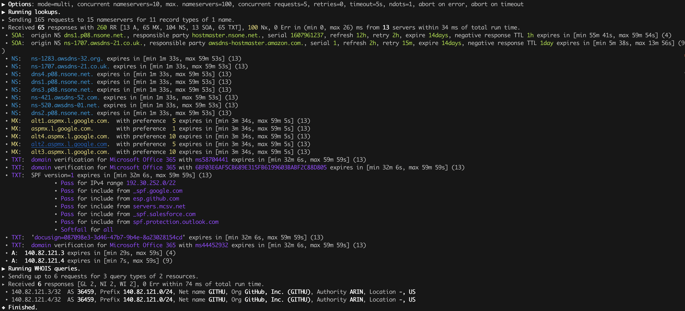

# mhost

A modern take on the classic `host` DNS lookup utility including an easy to use, and very fast Rust lookup library.


## Features

* `mhost` is very fast and uses multiple DNS servers massively parallel aggregating results for more reliable lookups.
* `mhost` presents results in an easy, human readable format or as JSON for post-processing.
* `mhost` discovers hostnames and subdomains of any domain.
* `mhost` uses lints to validate the DNS configurations of any domain.
* `mhost` offers an easy to use Rust library to use `mhost` lookup capabilities in your projects.

For details see sections [Use Cases](#Use-Cases) and [Documentation](#Documentation) of this Readme.


## Quick Start

1. Install `mhost` -- below for [installation instructions](#Installation).
1. Run `mhost -p l --all -w github.com` and you've just asked 16 nameservers for all available DNS records of _github.com_ in 216 ms. And in addition you get the WHOIS information for GitHub's subnet.
    
1. Run `mhost -q -p --output json l --all -w github.com  | jq '.lookups[] | .result.Response.records[]? | select(.type == "A") | .data.A'` and get all IPv4 addresses.
1. Set shell alias `alias host=mhost l` to replace your system's `host` command.
   

## Use Cases

### Just lookup an IP address 

`mhost l github.com`

- local system name servers 
- default records types

### Just lookup an IP address, using more than just your local DNS servers

`mhost -p l github.com`

See, there's more answers than before!

### Just lookup an IP address, using even more than just your local DNS servers

```
mhost server-lists 'public-dns' -o severs.txt
mhost --limit 6000 --max-concurrent-servers 1000 --timeout 1 -f servers.txt l www.github.com
```

### Discover a domain

`mhost -p l --all -w github.com`
`mhost -p l --all 140.82.121.0/24`
`mhost -p d github.com -p`

### Check your DNS configuration is valid

`mhost -p c github.com -p`


## Installation

### From Source

Please install Rust via [rustup](https://www.rustup.rs) and then run

```bash
git clone https://github.com/lukaspustina/mhost
cd mhost
make install
```


## Documentation

`mhost` has three main commands: _lookup_, _discover_, and _check_. _lookup_ lookups up arbitrary DNS records of a domain name. _discover_ tries various methods to discover hostnames and subdomains of a domain. _check_ uses lints to check if all records of a domain name adhere to the DNS RFC.

#### General Options

```
        --use-system-resolv-opt                 Uses options set in /etc/resolv.conf
        --no-system-nameservers                 Ignores nameservers from /etc/resolv.conf
    -S, --no-system-lookups                     Ignores system nameservers for lookups
        --resolv-conf <FILE>                    Uses alternative resolv.conf file
        --ndots <NUMBER>                        Sets number of dots to qualify domain name as FQDN [default: 1]
        --search-domain <DOMAIN>                Sets the search domain to append if HOSTNAME has less than ndots dots
        --system-nameserver <IP ADDR>...        Adds system nameserver for system lookups; only IP addresses allowed
    -s, --nameserver <HOSTNAME | IP ADDR>...    Adds nameserver for lookups
    -p, --predefined                            Adds predefined nameservers for lookups
        --predefined-filter <PROTOCOL>...       Filters predefined nameservers by protocol [default: udp]  [possible
                                                values: udp, tcp, https, tls]
        --list-predefined                       Lists all predefined nameservers
    -f, --nameservers-from-file <FILE>          Adds nameservers from file
        --limit <NUMBER>                        Sets max. number of nameservers to query [default: 100]
        --max-concurrent-servers <NUMBER>       Sets max. concurrent nameservers [default: 10]
        --max-concurrent-requests <NUMBER>      Sets max. concurrent requests per nameserver [default: 5]
        --retries <NUMBER>                      Sets number of retries if first lookup to nameserver fails [default: 0]
        --timeout <TIMEOUT>                     Sets timeout in seconds for responses [default: 5]
    -m, --resolvers-mode <MODE>                 Sets resolvers lookup mode [default: multi]  [possible values: multi,
                                                uni]
        --wait-multiple-responses               Waits until timeout for additional responses from nameservers
        --no-abort-on-error                     Sets do-not-ignore errors from nameservers
        --no-abort-on-timeout                   Sets do-not-ignore timeouts from nameservers
        --no-aborts                             Sets do-not-ignore errors and timeouts from nameservers
    -o, --output <FORMAT>                       Sets the output format for result presentation [default: summary]
                                                [possible values: json, summary]
        --output-options <OPTIONS>...           Sets output options
        --show-errors                           Shows error counts
    -q, --quiet                                 Does not print anything but results
        --no-color                              Disables colorful output
        --ascii                                 Uses only ASCII compatible characters for output
    -v                                          Sets the level of verbosity
        --debug                                 Uses debug formatting for logging -- much more verbose
```

### Main Commands

#### Lookup

```
    -t, --record-type <RECORD TYPE>...    Sets record type to lookup, will be ignored in case of IP address lookup
                                          [default: A,AAAA,CNAME,MX]  [possible values: A, AAAA, ANAME, ANY, CNAME, MX,
                                          NULL, NS, PTR, SOA, SRV, TXT]
        --all                             Enables lookups for all record types
    -s, --service                         Parses ARG as service spec and set record type to SRV
    -w, --whois                           Retrieves Whois information about A, AAAA, and PTR records
    -h, --help                            Prints help information
    -V, --version                         Prints version information

    <DOMAIN NAME | IP ADDR | CIDR BLOCK [| SERVICE SPEC]>    domain name, IP address, or CIDR block to lookup
            domain name, IP address, CIDR block, or, if -s, SERVICE SPEC, to lookup"
            * DOMAIN NAME may be any valid DNS name, e.g., lukas.pustina.de
            * IP ADDR may be any valid IPv4 or IPv4 address, e.g., 192.168.0.1
            * CIDR BLOCK may be any valid IPv4 or IPv6 subnet in CIDR notation, e.g., 192.168.0.1/24
              all valid IP addresses of a CIDR block will be queried for a reverse lookup
            * SERVICE SPEC may be specified by name, protocol, and domain name, delimited by colons. If protocol is
            omitted, tcp is assumed, e.g.,
              * dns:udp:example.com is _dns._udp.example.com
              * smtp:tcp:example.com is _smtp._tcp.example.com
              * smtp::example.com is _smtp._tcp.example.com
```

#### Discover

```
    -p, --show-partial-results         Shows results after each lookup step
    -w, --wordlist-from-file <FILE>    Uses wordlist from file
        --rnd-names-number <NUMBER>    Sets number of random domain names to generate for wildcard resolution check
                                       [default: 3]
        --rnd-names-len <LEN>          Sets length of random domain names to generate for wildcard resolution check
                                       [default: 32]
    -s, --subdomains-only              Shows subdomains only omitting all other discovered names

```

#### Check

```
    -p, --show-partial-results         Shows results after each check step
    -i, --show-intermediate-lookups    Shows all lookups made during by all checks
        --no-cnames                    Does not run cname lints
        --no-soa                       Does not run SOA check
        --no-spf                       Does not run SPF check
```

### Helper Commands

#### Server Lists

```
    -o, --output-file <FILE>    Sets path to output file
    <SERVER LIST SPEC>...
        SERVER LIST SPEC as <SOURCE>[:OPTIONS,...]
        * 'public-dns' with options - cf. https://public-dns.info
          '<top level country domain>': options select servers from that country
           Example: public-dns:de
        * 'opennic' with options; uses GeoIP to select servers - cf. https://www.opennic.org
           'anon' - only return servers with anonymized logs only; default is false
           'number=<1..>' - return up to 'number' servers; default is 10
           'reliability=<1..100> - only return server with reliability of 'reliability'% or more; default 95
           'ipv=<4|6|all> - return IPv4, IPv6, or both servers; default all
            Example: opennic:anon,number=10,ipv=4
```


### Architecture Design Records

The subdirectory `doc/adr` contains Architecture Design Records (ADRs) for this project. Record keeping has started during the project so not all decisions have been recorded. I still hope they will help everybody interested including me to understand the rational of design decisions.

## Changelog

Please see the [CHANGELOG](CHANGELOG.md) for a release history.


## Limitations

* Currently `mhost` only supports class `IN`.
* Only a limited set of DNS record types is supported.
* The Docker test environment only works completely on Linux due to [limitations](https://docs.docker.com/docker-for-mac/networking/#known-limitations-use-cases-and-workarounds) in Docker for macOS.


## Thanks

Thanks to [Benjamin Fry](https://github.com/bluejekyll) for his literally wonderful [Trust-DNS](http://trust-dns.org) server and the corresponding client library which does all the heavy DNS lifting of `mhost`.


## Postcardware

You're free to use `mhost`. If you find it useful, I would highly appreciate you sending me a postcard from your hometown mentioning how you use `mhost`. My work address is

 ```
 Lukas Pustina
 CenterDevice GmbH
 Rheinwerkallee 3
 53227 Bonn
 Germany
 ```
